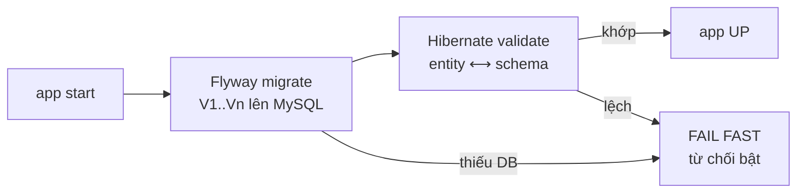

# Thiết kế: kyc-service — H2 in-memory → MySQL + Flyway

- **Ngày:** 2026-07-06
- **Phạm vi:** Trả nợ nền tảng của kyc-service: toàn bộ 4 bảng (`kyc_case`, `kyc_submission`, `kyc_decision`, `outbox`) đang nằm trong H2 **in-memory** với `ddl-auto=update` — restart là mất sạch. Chuyển sang MySQL (persistent) + Flyway (schema có kiểm soát), `ddl-auto=validate`.
- **Tiền đề:** Outbox (2026-06-23) đã bịt khe dual-write *trong process* — nhưng row `outbox` PENDING vẫn chết theo restart vì DB sống trong RAM. Wallet đã có sẵn pattern MySQL + Flyway + Testcontainers.
- **Mục tiêu học:** durability vs correctness, schema migration có kiểm soát (Flyway vs ddl-auto), test trên dialect thật, crash-recovery e2e.

> **Nguồn gốc:** quyết định M1–M6 do người học suy ra (Socratic).

---

## 1. Vấn đề: dữ liệu không thể tái tạo sống trong RAM

Restart kyc-service (deploy/crash/OOM) → cả 4 bảng bay:

- `kyc_decision` là **log gốc** (event-source-like): có nó thì dựng lại được projection (`kyc_case`), nhưng chính nó **không tái tạo được từ đâu cả** — verifier bên ngoài không gửi lại quyết định cũ. Mất là mất vĩnh viễn (kể cả giá trị audit/compliance).
- `kyc_submission` cũng không tái tạo được — hồ sơ PENDING (chưa có decision) chỉ tồn tại ở đây.
- `outbox` PENDING mất → event `kyc.revoked` **vẫn mất** dù đã có outbox pattern — outbox chỉ nguyên tử với DB, mà DB lại không bền. Wallet giữ cache APPROVED → user bị revoke vẫn rút được tiền.
- Hệ quả dây chuyền: user "biến mất" khỏi KYC → NOT_STARTED → phải submit lại; wallet tin vào trạng thái không còn tồn tại.

→ Đây là việc **sống còn**, không phải tối ưu hoá. Và là tiền đề để outbox phát huy trọn giá trị.

---

## 2. Bảng quyết định (M1–M6, Socratic)

| # | Quyết định | Lý do (người học tự suy ra) |
|---|---|---|
| M1 | **Bỏ H2 hoàn toàn** — MySQL là DB duy nhất ở mọi nơi có DB: runtime (dev + prod) và mọi test chạm DB (Testcontainers). Test thuần domain/service (không DB) giữ nguyên. | Test trên chính dialect chạy prod ("chấp nhận CI chậm, đổi lấy chứng minh fault-tolerance thật"); `V1` chỉ cần viết cho MySQL, thoát ràng buộc SQL hai-dialect. Chi phí *cố tình trả*: mọi test JPA chờ container; dev cần `docker compose up` trước khi chạy app. |
| M2 | **Flyway `V1__create_tables.sql`** chứa `CREATE TABLE` cả 4 bảng + unique constraints; **`ddl-auto=validate`**. | Schema từ migration, không từ Hibernate tự sinh. `validate` biến Hibernate thành *gác cổng*: entity lệch migration → app từ chối bật lúc startup, thay vì `update` âm thầm vá schema (migration thành lời nói dối). |
| M3 | **Không có bước data migration.** | H2 in-mem không có dữ liệu bền để chuyển — greenfield về mặt dữ liệu. (Chính điều đó là lý do phải làm việc này.) |
| M4 | **Config qua env** `KYC_DB_URL` / `KYC_DB_USERNAME` / `KYC_DB_PASSWORD` (mirror pattern `WALLET_DB_*`); **MySQL thêm vào `docker-compose.yml`** cạnh Kafka; **không có fallback in-memory** — thiếu DB thì app fail-fast. | Nếu giữ H2 làm mặc định "cho tiện dev" thì bug sống-còn chỉ được sửa *khi ai đó nhớ set env* — mặc định phải là cấu hình đúng. |
| M5 | **Chiến lược test 2 tầng:** (a) thuần domain/service — `KycCaseTest` (21), `KycServiceTest` (8) — không DB, giữ nguyên, chạy nhanh; (b) mọi test chạm DB (slice JPA + integration + outbox) — **Testcontainers MySQL**, tái dùng pattern wallet. | 21 test state machine kiểm *logic chuyển trạng thái*, không kiểm SQL — bắt nó chờ container là thuế thời gian vô nghĩa. Ngược lại, test JPA/integration trên H2 chứng minh hành vi của... H2. |
| M6 | **Tiêu chí "xong" = e2e crash-recovery** (kịch bản §4): dữ liệu và event sống sót qua `kill -9` + restart. Kiểm bằng **cả hai tầng**: SQL `SELECT` (source of truth — row còn đó) và API `GET .../status` (behavior — hệ thống hành xử đúng với row đó). | "Persist xuống disk" là cơ chế, chưa phải bằng chứng. Kịch bản này H2 in-memory *về nguyên tắc không bao giờ pass* — nó là ranh giới đo được giữa trước và sau. |

---

## 3. Đổi gì ở code hiện tại

| Chỗ | Trước | Sau |
|---|---|---|
| `kyc-service/pom.xml` | H2 runtime | `mysql-connector-j` (runtime) + `flyway-core` + `flyway-mysql`; test: `testcontainers` (mysql, junit-jupiter). H2 **gỡ hẳn**. |
| `application.yml` | `jdbc:h2:mem:kycdb`, `ddl-auto=update` | `${KYC_DB_URL}` / username / password (MySQL), `ddl-auto=validate`, Flyway enabled |
| `src/main/resources/db/migration/` | (không tồn tại) | `V1__create_tables.sql`: `kyc_case` (PK userId, status, currentSubmissionId, version), `kyc_submission` (PK id, userId, documentRefs, submittedAt), `kyc_decision` (PK id, submissionId, type, decidedBy, reason, decidedAt, **UNIQUE (submissionId, type)**), `outbox` (id AUTO_INCREMENT PK, aggregate, topic, payload TEXT, status, traceId, createdAt, sentAt) |
| `docker-compose.yml` | chỉ Kafka | + MySQL 8 (port 3306, database `kycdb` tạo sẵn qua init hoặc `KYC_DB_URL` trỏ schema riêng — tách với schema của wallet) |
| Test chạm DB | H2 tự động | Testcontainers MySQL (singleton container pattern như wallet để không trả giá 1 container/test class) |
| `e2e/` | — | kịch bản crash-recovery mới (§4); các script cũ chạy kyc với env DB mới |

Luồng khởi động sau thay đổi:



---

## 4. Kịch bản kiểm chứng (e2e crash-recovery — tiêu chí M6)

```
Phần 1 — dữ liệu sống sót:
  ① tạo vài submission + áp decision (APPROVE) → có dữ liệu thật trong MySQL
  ② kill -9 PID kyc-service
  ③ bật lại app
  ④ assert 2 tầng:
       SQL:  SELECT — kyc_case/kyc_submission/kyc_decision còn nguyên (source of truth)
       API:  GET /kyc/cases/{userId}/status = APPROVED (behavior)

Phần 2 — event sống sót (outbox × restart, nâng cấp của outbox-not-lost.sh):
  ⑤ revoke user (relay initial-delay lớn → row outbox PENDING, CHƯA gửi)
  ⑥ kill -9 kyc TRƯỚC khi relay kịp chạy   ← trước đây: event chết tại đây
  ⑦ bật lại app → row PENDING vẫn trong MySQL → relay tick đầu gửi nốt (retry)
  ⑧ assert: wallet consume kyc.revoked → withdraw trả 403
```

---

## 5. Nợ kỹ thuật & YAGNI

- **Vận hành MySQL prod** (backup/restore, replication, connection pool tuning) — ngoài phạm vi; đây là bài học persistence, không phải bài vận hành DBA.
- **Multi-tenant cho kyc** (schema-per-tenant như wallet SP5) — chưa cần; kyc hiện single-schema, key theo userId.
- **Gộp/không gộp MySQL với wallet**: dùng chung *server* MySQL trong compose là được, nhưng **schema riêng** (`kycdb`) — không chia sẻ bảng. Tách server thật khi cần.
- Outbox row `outbox` giờ bền → follow-up cũ (poison-row alert, multi-instance lease — design 2026-06-23 §5) vẫn giữ nguyên vị trí trong ledger.

---

## 6. Chiến lược kiểm thử

```
Không DB (giữ nguyên, nhanh):   KycCaseTest (21), KycServiceTest (8)
Testcontainers MySQL:           JpaKycCaseRepositoryTest, JpaOutboxRepositoryTest,
                                KycIntegrationTest, KycServiceOutboxIntegrationTest,
                                OutboxRelayTest, OutboxPurgeTest, ... (mọi test chạm DB)
                                — singleton container, Flyway chạy migration thật
e2e:                            crash-recovery script (§4) + regression các script cũ
Regression:                     80 test kyc hiện có phải xanh trên MySQL; wallet 262 không đụng
```

---

## 7. Lộ trình triển khai (TDD — chi tiết ở plan)

1. Dependencies + Testcontainers hạ tầng test (singleton container) — chuyển slice test JPA sang MySQL, còn ddl-auto.
2. `V1__create_tables.sql` + bật Flyway + `ddl-auto=validate` — toàn bộ test xanh trên schema do Flyway dựng.
3. Runtime config (env `KYC_DB_*`), gỡ H2 khỏi pom, MySQL vào docker-compose.
4. e2e crash-recovery (§4) + regression e2e cũ.
